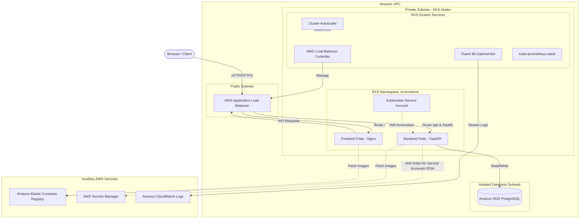
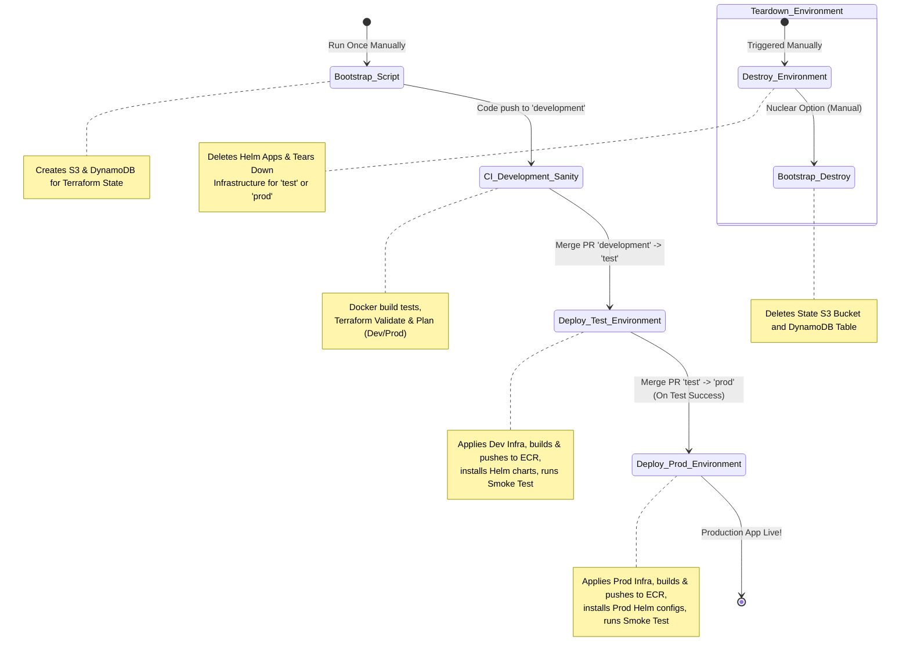

# NimbusMart AWS EKS Deployment & Architecture Guide

Welcome to the comprehensive deployment and architecture guide for **NimbusMart** (originally ShopEKS), a cloud-native, high-performance e-commerce demonstration application. 

This document details the system architecture, API endpoints, workspace structure, and AWS services structure. It also outlines the transition from Jenkins to **GitHub Actions** and provides step-by-step instructions to deploy, run, and scale the application on Amazon Web Services (AWS) using an enterprise-grade 3-branch pipeline strategy.

---

## 1. System Architecture

NimbusMart uses a decoupled, three-tier architecture containerized with Docker and orchestrated using Amazon Elastic Kubernetes Service (EKS).

### High-Level Architecture Diagram


### Architectural Design Decisions
1. **Containerization**: Both the frontend (Nginx serving static assets) and backend (FastAPI/Uvicorn) are containerized using optimized, multi-stage Dockerfiles.
2. **Infrastructure as Code (IaC)**: Infrastructure is modularized and managed via **Terraform v1.7.5**, ensuring environment consistency between Dev and Prod.
3. **Container Orchestration**: **Amazon EKS** handles the lifecycle, scaling, and distribution of application workloads.
4. **Relational Database**: **Amazon RDS PostgreSQL** provides stable, reliable relational storage for product lists and cart items.
5. **Secure State & Secrets Management**:
   - No static database passwords or AWS Access Keys are baked into images.
   - Database credentials are created randomly by Terraform and stored in **AWS Secrets Manager**.
   - The backend pods retrieve database credentials dynamically using **IAM Roles for Service Accounts (IRSA)**.
   - GitHub Actions connects to AWS securely using **OpenID Connect (OIDC) federation**, completely eliminating long-lived AWS IAM Access Keys.

---

## 2. Workspace & Codebase Structure

The project directory is structured to separate application source code, infrastructure declarations, deployment definitions, and CI/CD pipelines:

```text
e-com/
├── .github/
│   └── workflows/              # GitHub Actions workflows (CI/CD)
│       ├── bootstrap.yml       # One-time S3/DynamoDB state setup
│       ├── bootstrap-destroy.yml # Destroys state infrastructure
│       ├── ci-development.yml  # Docker build and Terraform plan validation (Dev/Prod)
│       ├── deploy-test.yml     # Auto-deploys Dev/Test Infra & App on merge to test
│       ├── deploy-prod.yml     # Auto-deploys Prod Infra & App on merge to prod
│       └── destroy.yml         # Teardown application and VPC resources (test or prod)
├── apps/
│   ├── backend/                # Python FastAPI backend application
│   │   ├── main.py             # FastAPI routing and app startup
│   │   ├── database.py         # SQLAlchemy engine setup and Secrets Manager client
│   │   ├── models.py           # SQLAlchemy database tables (products, cart_items)
│   │   ├── schemas.py          # Pydantic v2 schemas for requests & validation
│   │   ├── requirements.txt    # Python dependencies
│   │   ├── Dockerfile          # Multi-stage optimized Docker build
│   │   └── .dockerignore
│   └── frontend/               # Static Web App frontend
│       ├── index.html          # HTML UI skeleton
│       ├── style.css           # Custom CSS styling (vanilla responsive styling)
│       ├── script.js           # Client-side logic and API fetch requests
│       ├── nginx.conf          # Nginx configurations for reverse routing
│       ├── Dockerfile          # Nginx Alpine container packaging
│       └── .dockerignore
├── helm/                       # Helm deployment definitions
│   ├── ecommerce/              # Application Helm chart
│   │   ├── Chart.yaml          # Chart metadata
│   │   ├── values.yaml         # Base defaults (replicas, CPU, ports)
│   │   ├── values-dev.yaml     # Dev environment overrides
│   │   ├── values-prod.yaml    # Prod environment overrides (high availability)
│   │   └── templates/          # Kubernetes manifests (deployments, ingress, services, HPA)
│   └── infrastructure/         # Core cluster integrations
│       ├── aws-load-balancer-controller/ # Custom ALB configurations
│       ├── cluster-autoscaler/ # Pod & Node autoscaling configs
│       ├── logging/            # Fluent Bit configs (logs → CloudWatch)
│       └── monitoring/         # Prometheus & Grafana configurations
└── terraform/                  # Infrastructure provisioning
    ├── environments/           # Environment entry-points
    │   ├── dev/                # Dev environment values & variables (acts as Test infra)
    │   └── prod/               # Prod environment configurations
    └── modules/                # Reusable AWS modules
        ├── vpc/                # Multi-AZ networks, route tables, subnets
        ├── eks/                # Control plane, security groups, OIDC provider
        ├── ecr/                # Elastic Container Registry repositories
        ├── rds/                # PostgreSQL server, DB subnet group, rules
        ├── secrets-manager/    # AWS Secret store for DB credentials
        └── iam/                # IAM Roles for Service Accounts (IRSA) policies
```

---

## 3. Application API Documentation

The backend service is powered by FastAPI, exposing a documented REST API. By default, swagger documentation is generated and served at `/docs`.

### API Endpoints List

| Category | HTTP Method | Path | Request Headers / Body | Response Schema | Description |
| :--- | :--- | :--- | :--- | :--- | :--- |
| **Health** | `GET` | `/health` | None | `HealthResponse` | Liveness/readiness probe. Performs SQL DB ping. |
| **Products** | `GET` | `/products` | Query filters (optional) | `list[ProductRead]` | List active products with pagination and category search. |
| **Products** | `GET` | `/products/{id}`| None | `ProductRead` | Retrieve details for a single product. |
| **Products** | `POST` | `/products` | `ProductCreate` | `ProductRead` | Create a new product. (Enforces name uniqueness). |
| **Products** | `PATCH` | `/products/{id}`| `ProductUpdate` | `ProductRead` | Partially update a product's price, stock, category, etc. |
| **Products** | `DELETE`| `/products/{id}`| None | `MessageResponse` | Soft-deletes a product (sets `is_active = False`). |
| **Cart** | `GET` | `/cart` | `X-Session-ID` header | `CartSummary` | Retrieve cart summary (items, total items count, total price). |
| **Cart** | `POST` | `/cart` | `X-Session-ID` header, `CartItemCreate` | `CartSummary` | Add a product to the cart or increment its quantity. |
| **Cart** | `PATCH` | `/cart/{item_id}`| `X-Session-ID` header, `CartItemUpdate` | `CartSummary` | Update the quantity of a specific cart line item. |
| **Cart** | `DELETE`| `/cart/{item_id}`| `X-Session-ID` header | `CartSummary` | Remove a product item entirely from the session's cart. |
| **Cart** | `DELETE`| `/cart` | `X-Session-ID` header | `MessageResponse` | Clear all items from the current user session's cart. |

### Session Tracking & State Management
* **X-Session-ID**: Since NimbusMart does not require authentication for demo purposes, shopping carts are isolated using the `X-Session-ID` HTTP request header.
* The frontend generates a unique UUID on its first load and stores it in the browser's `localStorage`.
* This token is sent automatically with every cart API request. If the header is missing, the backend defaults the session to `"anonymous"`.

---

## 4. AWS Infrastructure Architecture

The NimbusMart AWS infrastructure is modularized and deployed via Terraform. Below is the detailed configuration of each service:

### A. Network Architecture (VPC Module)
* **Subnet Layout**: 6 Subnets spread across 3 Availability Zones (AZs) to ensure high availability.
  * **3 Public Subnets**: Used to deploy the public Application Load Balancer.
  * **3 Private Subnets**: Host EKS Worker Nodes and Elastic Network Interfaces (ENIs). Private subnets route outbound traffic via NAT Gateways.
* **NAT Gateways**: Public facing NAT gateways in each public subnet to allow private instances to contact AWS endpoints (ECR, Secrets Manager) and download packages safely.
* **Tagging Rules**: Subnets are annotated with tags so EKS can identify ingress subnets:
  * Public Subnets: `kubernetes.io/role/elb = 1`
  * Private Subnets: `kubernetes.io/role/internal-elb = 1`

### B. Amazon EKS Cluster (EKS Module)
* **Control Plane**: Managed Kubernetes Control Plane running v1.29+.
* **Worker Node Groups**: Self-healing Managed Node Groups.
  * In the **Test** environment (backed by Dev infra), nodes are provisioned using **AWS SPOT Capacity** to save up to 70% in costs.
  * In the **Prod** environment, stable **ON_DEMAND Capacity** instances are used.
  * Auto-scaling is managed by the **Cluster Autoscaler** Helm chart, scaling nodes dynamically depending on resource requests.
* **OIDC Federation**: An OpenID Connect provider is established for the cluster. This maps Kubernetes Service Accounts to AWS IAM Roles.

### C. Amazon ECR (ECR Module)
* Secure repositories created for storing Docker images:
  * `ecommerce-frontend`
  * `ecommerce-backend`
* Configured with lifecycle policies to clean up old untagged images, keeping cloud storage costs low.

### D. Amazon RDS PostgreSQL (RDS Module)
* An isolated PostgreSQL engine deployed in private database-specific subnets.
* Access is strictly restricted: only the EKS Node Security Group is allowed to connect on port `5432`.
* Multi-AZ replication is enabled for production environments but disabled in Test/Dev to reduce runtime costs.

### E. AWS Secrets Manager (Secrets Manager Module)
* Stores PostgreSQL connection credentials in JSON format:
  * `username`, `password` (cryptographically secure string), `host` (RDS writer endpoint), `port`, and `dbname`.
* The secret is named `${environment}/ecommerce/db` (e.g., `dev/ecommerce/db` or `prod/ecommerce/db`).

### F. IAM & IRSA (IAM Module)
* Configures IAM Roles for Service Accounts (IRSA).
* Instead of mapping static AWS secret keys inside Kubernetes, Kubernetes Service Accounts are annotated with IAM Role ARNs:
  1. `backend-sa-role`: Grants the backend pods permissions to fetch `database` secret value from Secrets Manager.
  2. `aws-load-balancer-controller-role`: Grants the controller permissions to create, update, and manage Application Load Balancers on AWS.
  3. `fluent-bit-role`: Grants Fluent Bit pods permissions to create log streams and put log events in Amazon CloudWatch.

---

## 5. CI/CD Migration: Jenkins to GitHub Actions

All legacy Jenkins files (`Jenkinsfile`, pipeline scripts) have been completely removed from the project folder. The project now uses **GitHub Actions** workflows located in `.github/workflows/`. 

This eliminates the need to manage and patch a dedicated Jenkins server, utilizing GitHub’s fully managed runners and secure OpenID Connect integration.

### Workflows Catalog



1. **Bootstrap Script** (`bootstrap.yml`):
   * **Trigger**: Manual workflow dispatch.
   * **Purpose**: Creates the secure S3 bucket and DynamoDB locking table used for storing the Terraform remote backend state. Run this once per account.
2. **CI Development Sanity** (`ci-development.yml`):
   * **Trigger**: Push or PR targeting the `development` branch.
   * **Purpose**: Runs syntax validation and compiles Docker images for frontend and backend. Also runs `terraform plan` for both Dev and Prod to verify no breaking configuration errors exist.
3. **Deploy Test Environment** (`deploy-test.yml`):
   * **Trigger**: Push/Merge to the `test` branch.
   * **Purpose**: Provisions/updates AWS Dev environment resources, compiles and pushes Docker containers to ECR, deploys utilities and applications using Helm on the EKS Dev cluster, and executes an automated smoke test hitting `/health` to verify success.
4. **Deploy Prod Environment** (`deploy-prod.yml`):
   * **Trigger**: Push/Merge to the `prod` branch.
   * **Purpose**: Provisions/updates AWS Prod environment resources, pushes Docker images, deploys high-availability application workloads using Helm on the EKS Prod cluster, and runs a final validation smoke test.
5. **Destroy Environment** (`destroy.yml`):
   * **Trigger**: Manual execution.
   * **Purpose**: Uninstalls application Helm charts (deleting the public AWS ALB) and then executes `terraform destroy` for the chosen environment (`test` or `prod`).
6. **Bootstrap Destroy** (`bootstrap-destroy.yml`):
   * **Trigger**: Manual execution.
   * **Purpose**: Force-deletes the Terraform remote state S3 bucket (including all state history and versions) and the DynamoDB locking table. Only run when abandoning the project.

---

## 6. Step-by-Step AWS Deployment Instructions

Follow these instructions to deploy NimbusMart into your AWS account.

### Prerequisites
Before you start, ensure you have the following locally or in your terminal:
1. **AWS CLI** installed and configured with Admin permissions.
2. **Terraform CLI (v1.7.5+)** installed.
3. **kubectl** and **helm** installed.
4. An active **GitHub Repository** for the project.

---

### Step 1: Push NimbusMart to your GitHub Repository
If you haven't pushed your code to your remote repository yet, run the following commands in your project root:

```bash
git init
git add .
git commit -m "feat: Initial commit of NimbusMart codebase"
git branch -M development
git remote add origin https://github.com/PRADEEPMK06/NimbusMart.git
git push -u origin development
```

---

### Step 2: Establish OIDC Trust between GitHub Actions and AWS
To deploy without embedding long-lived AWS credentials (which is a security hazard), we configure AWS to trust GitHub's OpenID Connect (OIDC) identity provider.

#### 1. Create the OIDC Identity Provider in AWS (If not already created)
Open your terminal and run:
```bash
aws iam create-open-id-connect-provider \
  --url "https://token.actions.githubusercontent.com" \
  --client-id-list "sts.amazonaws.com" \
  --thumbprint-list "6938fd4d98bab03faadb97b34396831e3780aea1"
```

#### 2. Create the IAM Role for GitHub Actions
Save the following trust policy as `trust-policy.json` (replace `PRADEEPMK06/NimbusMart` with your repository path):
```json
{
  "Version": "2012-10-17",
  "Statement": [
    {
      "Effect": "Allow",
      "Principal": {
        "Federated": "arn:aws:iam::YOUR_AWS_ACCOUNT_ID:oidc-provider/token.actions.githubusercontent.com"
      },
      "Action": "sts:AssumeRoleWithWebIdentity",
      "Condition": {
        "StringEquals": {
          "token.actions.githubusercontent.com:aud": "sts.amazonaws.com"
        },
        "StringLike": {
          "token.actions.githubusercontent.com:sub": "repo:PRADEEPMK06/NimbusMart:*"
        }
      }
    }
  ]
}
```

Create the IAM role and attach the Administrator Access policy (needed by GitHub Actions to deploy VPCs, databases, EKS clusters, and load balancers):
```bash
# Create the deployment role
aws iam create-role \
  --role-name "GitHubActionsDeploymentRole" \
  --assume-role-policy-document file://trust-policy.json

# Attach the policy
aws iam attach-role-policy \
  --role-name "GitHubActionsDeploymentRole" \
  --policy-arn "arn:aws:iam::aws:policy/AdministratorAccess"
```
Keep note of the generated Role ARN (e.g., `arn:aws:iam::123456789012:role/GitHubActionsDeploymentRole`).

---

### Step 3: Configure GitHub Repository Secrets
Navigate to your GitHub repository: **Settings** -> **Secrets and variables** -> **Actions** -> **New repository secret**.

Define the following Repository Secrets:

| Secret Name | Value Example | Description |
| :--- | :--- | :--- |
| `AWS_ROLE_ARN` | `arn:aws:iam::123456789012:role/GitHubActionsDeploymentRole` | The role created in Step 2 for test/dev environments. |
| `AWS_ROLE_ARN_PROD` | `arn:aws:iam::123456789012:role/GitHubActionsDeploymentRole` | The role created in Step 2 for prod environments. |
| `AWS_REGION` | `us-west-2` | Target AWS region for deployment. |
| `AWS_ACCOUNT_ID` | `123456789012` | Your 12-digit AWS Account ID. |
| `TF_STATE_BUCKET` | `nimbusmart-eks-tfstate` | Name for your Terraform remote state S3 bucket (must be globally unique). |
| `TF_STATE_LOCK_TABLE`| `nimbusmart-eks-tflock` | Name for the DynamoDB table used for locking state. |
| `GRAFANA_ADMIN_PASSWORD`| `SuperSecretPassword123` | Desired admin panel password for the Grafana dashboard. |

---

### Step 4: Run the Bootstrap Workflow
Before running the main infrastructure build, run the one-time script to create the S3 bucket and DynamoDB table.

1. In your GitHub repository, click on the **Actions** tab.
2. Select **Bootstrap_Script** in the left sidebar.
3. Click **Run workflow**.
4. In the `confirm` box, type **`bootstrap`** and click **Run workflow**.
5. Wait for the run to complete successfully.

---

### Step 5: Test Branch Deployment (Development & Testing environment)
Developers push code updates to the `development` branch, triggering automated build tests. Once tests pass:

1. Create a Pull Request (PR) from branch `development` to branch `test` inside GitHub.
2. Merge the PR. This will trigger the **Deploy_Test_Environment** workflow.
3. This workflow will automatically apply dev Terraform, compile Docker files, push to ECR, deploy Helm charts on EKS, and run a `/health` smoke test.
4. Verify the test URL returned by the workflow in the log output (e.g., `k8s-ecommerce-ecommerc-xxx.elb.us-west-2.amazonaws.com/health`).

---

### Step 6: Production Branch Deployment (Production environment)
Once validation completes successfully on the `test` branch:

1. Create a Pull Request (PR) from branch `test` to branch `prod` inside GitHub.
2. Merge the PR. This will trigger the **Deploy_Prod_Environment** workflow.
3. This workflow will provision prod Terraform, compile Docker files, push to ECR, deploy high-availability Helm charts on the EKS Prod cluster, and execute a smoke test.
4. Retrieve the Production ALB URL in the logs.

---

### Step 7: Tearing Down the Environment
If you need to remove the application and clean up AWS resources to avoid billing:

#### 1. Destroy Application & Infra
1. Go to **Actions** -> **Destroy_Environment**.
2. Click **Run workflow**.
3. Select Environment: **`test`** (to delete testing infra) or **`prod`** (to delete prod infra).
4. In the confirmation box, type: **`destroy-test`** or **`destroy-prod`**.
5. Click **Run workflow**.

#### 2. Destroy State Store (Optional)
If you wish to delete the Terraform Backend state store S3 bucket:
1. Go to **Actions** -> **Bootstrap_Destroy**.
2. Click **Run workflow**.
3. In the confirmation box, type: **`destroy-bootstrap`**.
4. Click **Run workflow**.

---

## 7. Operational & Maintenance Guide

### Accessing Logs
All application log output is sent automatically to CloudWatch.
* Log Group: `/aws/containerinsights/ecommerce-dev/application` or `/aws/containerinsights/ecommerce-prod/application`
* Look for log streams matching `backend-*` and `frontend-*` to inspect runtime outputs.

### Accessing Monitoring Dashboards
To access the Grafana dashboard:
1. Forward the Grafana port locally:
   ```bash
   kubectl port-forward svc/prometheus-grafana -n monitoring 3000:80
   ```
2. Open `http://localhost:3000` in your web browser.
3. Login using `admin` and your `GRAFANA_ADMIN_PASSWORD` secret.
